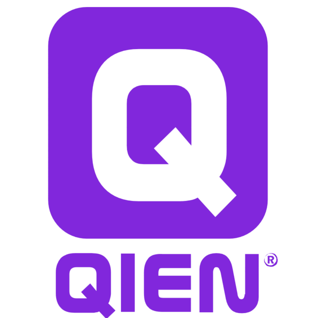

## Over mij

Ik hou er van om dingen vanuit het niets op te bouwen, een uitdaging aan te gaan en na te denken over hoe ik mijn doel kan bereiken. Het vinden van oplossingen voor complexe problemen en situaties geeft mij erg veel energie! Ik vind het fascinerend dat je aan de hand van iets abstracts zoals code een software applicatie kan bouwen. Door zelfstudie ben ik erachter gekomen dat het vak software ontwikkelaar precies al die elementen bevat waar ik energie van krijg. Ik ben daarom erg gemotiveerd om mij verder te ontwikkelen, voor een toekomst in de IT als software ontwikkelaar!

## Huidige baan

`2021 - Now`
**Junior software developer**, *Qien*, Utrecht
- *Low-code*
- *Java*
- *JavaScript*
- *HTML*
- *CSS*     

## Opleidingen

`2018 - 2019`
**Project manager B2B**, *Radion Amsterdam.*

`2014 - 2018`
**Club manager**, *Radion Amsterdam*

`2011 - 2013`
**Mede-eigenaar**, *Stichting KNUS Events*   

## Vaardigheden

| Technical          | Soft                 |
| ------------------ | -------------------- |
| Git                | Klantgericht         |
| Github             | Stressbestendig      |
| Java / Spring Boot | Oplossingsgericht    |
| JavaScript / NodeJS| Leergierig           |
| HTML               | Leiding geven        |
| CSS                |                      |
| SQL                |                      |

## Diploma's

`2014`
HBO, Media & Entertainment Management, Hogeschool Inholland. 

## Talen
- Nederlands
- Engels
- Duits

## References

* Wouter Stock: Financieel directeur, Radion Amsterdam.
* Jesper Verheij: Mede-eigenaar, KNUS events.
